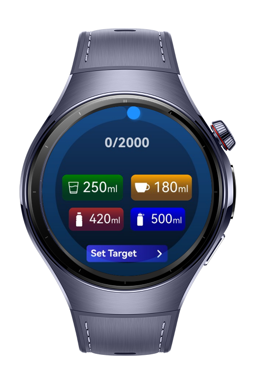
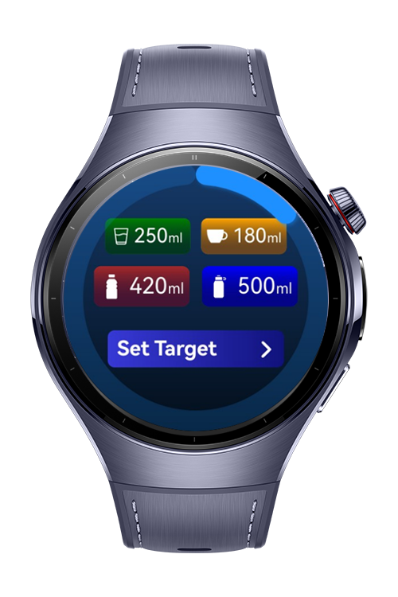
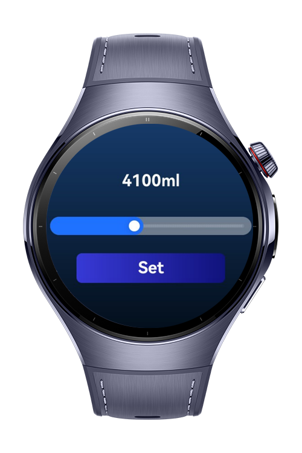
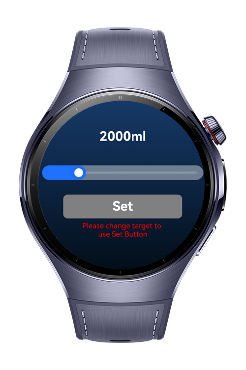

> **Note:** To access all shared projects, get information about environment setup, and view other guides, please visit 

# water-tracker

A simple water tracker app to help users stay hydrated by tracking their daily water intake goals.

# Preview

<p align="left">
  
  
  
  
</p>

# Use Cases

Ideal for fitness enthusiasts or anyone aiming to improve daily water consumption through simple yet effective tracking.

# Tech Stack

- **Languages**: ArkTS, Typescript
- **Frameworks**: HarmonyOS SDK 5.1.0(18)
- **Tools**: DevEco Studio Vers 5.1.0.842
- **Libraries**: @kit.ArkUI

# Directory Structure

```entry/src/main/ets/
|---core
| |---services
| | |---BaseViewModel.ets # Base view model
| | |---RouteService.ets # Route Service
| | |---WaterService.ets # Water Service
|---entryability
| |---EntryAbility.ets
|---entrybackupability
| |---EntryBackupAbility.ets  
|---ui
| |---pages
| | |---Index.ets 
| | |---SetTargetPage.ets # Target Setting Page
| |---viewmodels
| | |---IndexViewModel.ets 
| |---widgets
| | |---SetTargetButton.ets # Button component
| | |---SingleWaterItem.ets # Water item component
```

# Constraints and Restrictions
## Supported Devices
- Huawei Watch 5

# LICENSE

water-tracker is distributed under the terms of the MIT License.
See the [LICENSE](/LICENSE) for more information.